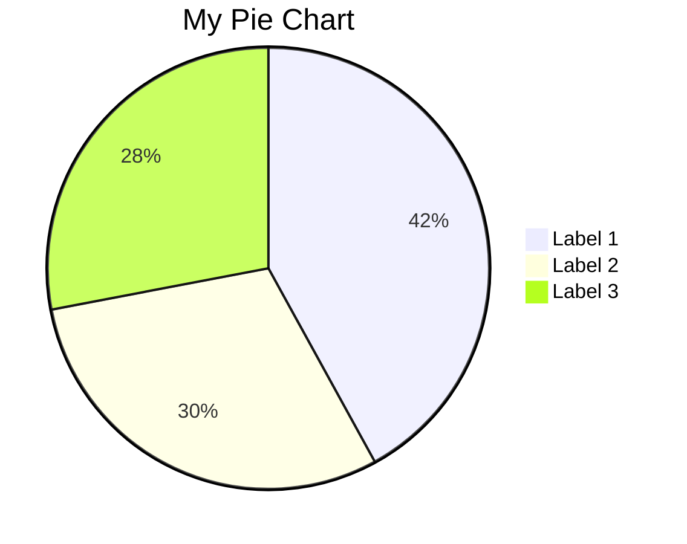
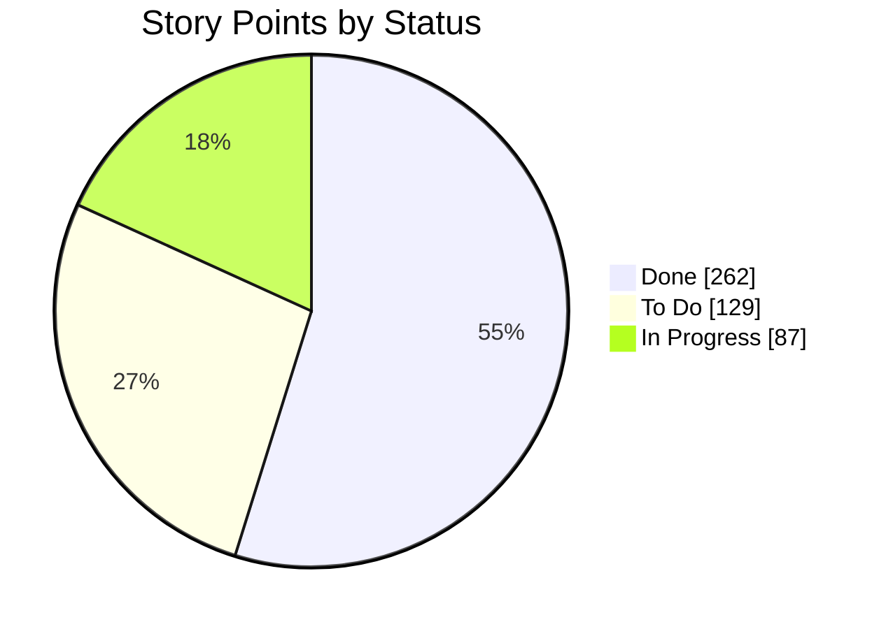
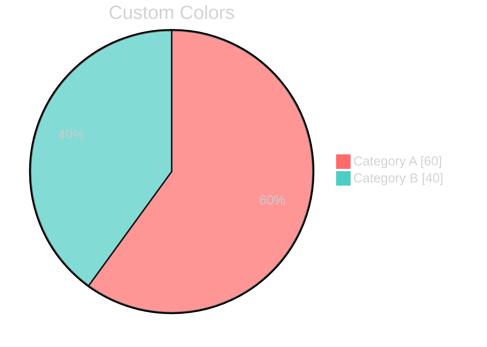

# Pisnge

A Rust-based diagram rendering library inspired by Mermaid.js, focused on generating SVG pie charts from Mermaid syntax.

## Features

- **Mermaid Compatibility**: Parses Mermaid pie chart syntax (.mmd files)
- **SVG Output**: Generates clean, scalable SVG files with full text support
- **PNG Output**: Generates raster PNG files with full text support
- **Theme Support**: Supports Mermaid theme configuration with custom colors
- **Default Colors**: Uses Mermaid's default D3 schemeCategory10 color palette
- **CLI Interface**: Simple command-line tool for batch processing

## Installation

### From crates.io

```bash
cargo install pisnge
```

### From source

```bash
git clone https://github.com/insidewhy/pisnge
cd pisnge
cargo build --release
```

## Usage

### Command Line

```bash
# Basic usage
pisnge -i input.mmd -o output.svg

# Specify format (defaults to png)
pisnge -i chart.mmd -o chart.svg -f svg
pisnge -i chart.mmd -o chart.png -f png

# If running from source
cargo run -- -i input.mmd -o output.svg
```

### Required Arguments

- `-i, --input`: Input Mermaid file (.mmd)
- `-o, --output`: Output file path

### Optional Arguments

- `-f, --format`: Output format - "png" or "svg" (defaults to "png")

## Mermaid Syntax Support

### Basic Pie Chart



### With Data Display



### With Theme Configuration



```bash
# Render an example pie chart
pisnge -i examples/storypoints-by-status-pie.mmd -o output.svg

# Or if running from source
cargo run -- -i examples/storypoints-by-status-pie.mmd -o output.svg
```

## Architecture

- **Parser** (`src/parser.rs`): Uses nom to parse Mermaid pie chart syntax
- **Renderer** (`src/renderer.rs`): Generates SVG using the `svg` crate
- **Data Structures** (`src/lib.rs`): Defines `PieChart`, `PieChartData`, and `PieChartConfig`

## Differences to Mermaid

This project currently only supports pie charts and all mermaid options should be supported, however only the `base` theme is supported and the default colors are different.

The pie chart segments are rendered in the order they are specified rather than from biggest to smallest, and the spacing is better since font widths/heights can be measured directly.

## Development

### Running Tests

```bash
cargo test
```

### Building

```bash
cargo build
```

## Dependencies

- `clap`: Command-line argument parsing
- `nom`: Parser combinator for Mermaid syntax
- `svg`: SVG generation
- `resvg`: SVG to PNG conversion
- `tiny-skia`: 2D graphics rasterization

## License

MIT License - see LICENSE file for details.

## Contributing

Contributions welcome! This library currently focuses on pie charts but could be extended to support other Mermaid diagram types.

## Roadmap

- [x] PNG output format
- [ ] Additional Mermaid diagram types (xy chart is planned soon)
- [ ] More theming options than provided by mermaid
